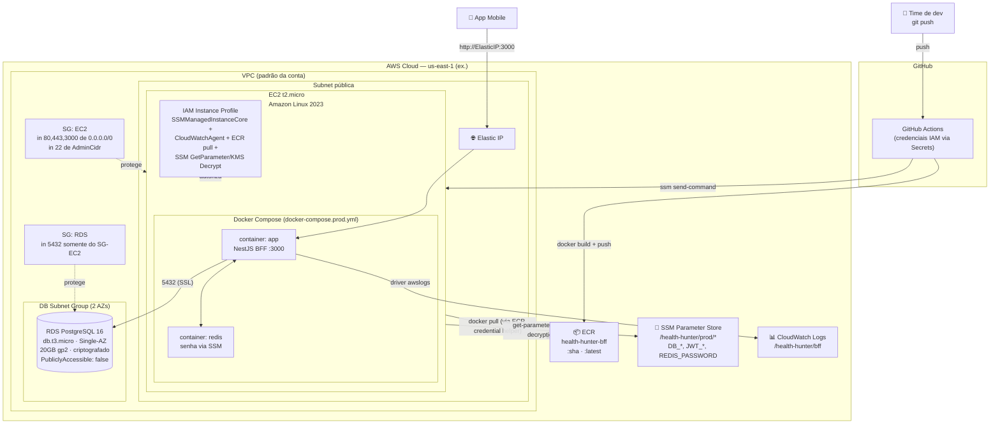
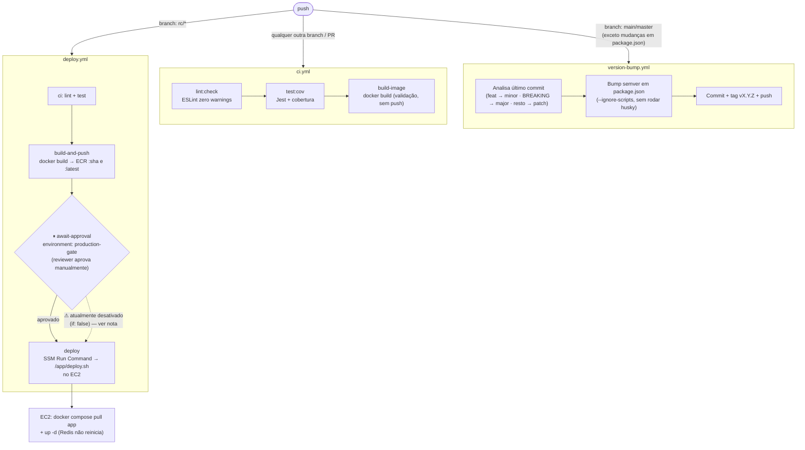
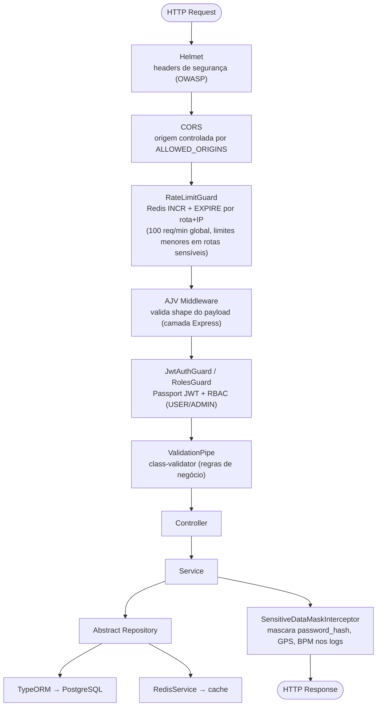
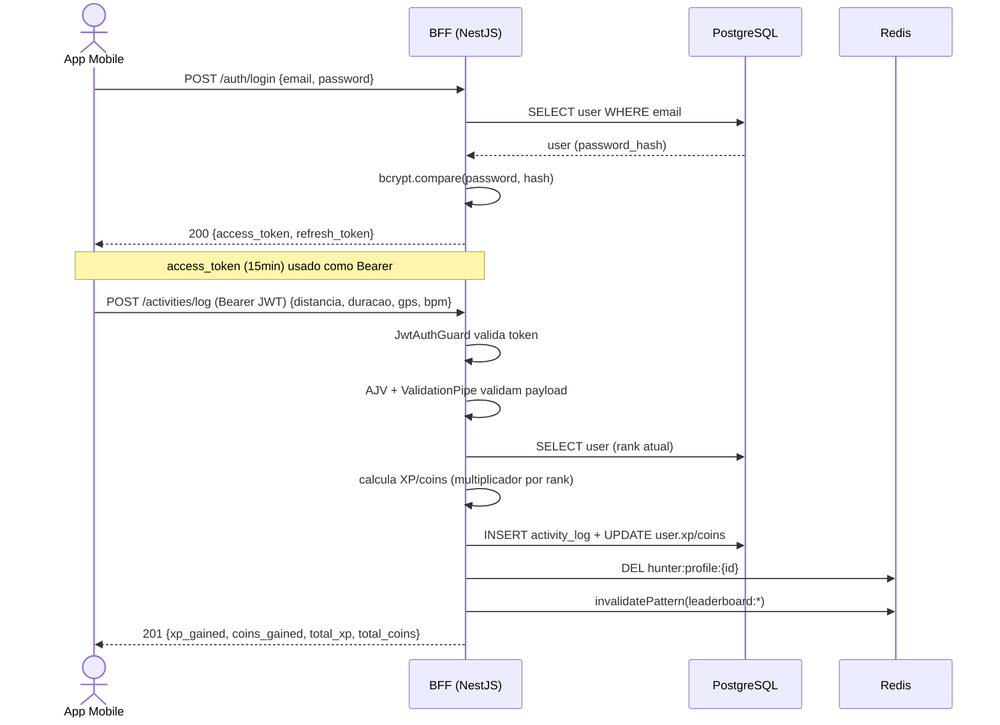
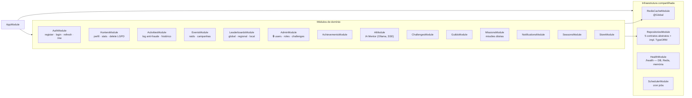
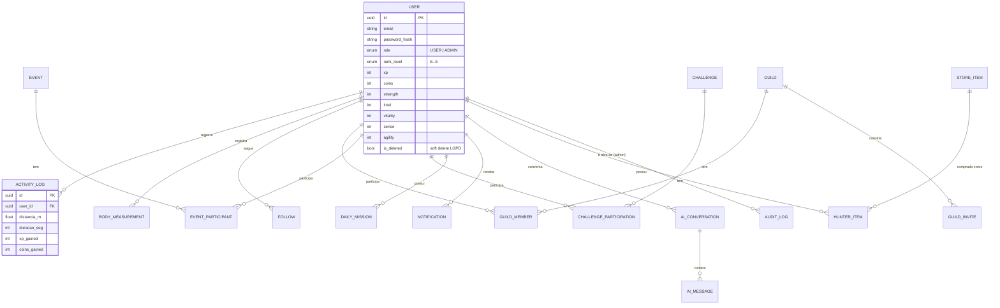

# Arquitetura — Health Hunter

Este documento descreve a arquitetura completa do **Health Hunter**: como o app mobile se conecta ao BFF, como o BFF está hospedado na AWS (free tier), e como o pipeline de CI/CD move código do commit até produção.

> Reflete o estado atual do código (branch `chore/nestjs-v12-esm-migration`): NestJS v12 (ESM), rate limiting próprio via Redis (substituindo `@nestjs/throttler`, ainda incompatível com v12), e IA Mentor via Ollama self-hosted.

---

## 1. Visão geral (contexto do sistema)

```mermaid
flowchart LR
    subgraph Clients["Clientes"]
        Mobile["📱 Health Hunter App<br/>Expo / React Native"]
        Swagger["🌐 Swagger UI / Postman<br/>(dev &amp; QA)"]
    end

    subgraph BFFBox["Health Hunter BFF — NestJS v12"]
        API["API REST<br/>/auth · /hunters · /activities<br/>/events · /leaderboards · /admin ..."]
    end

    PG[("PostgreSQL<br/>dados relacionais")]
    Redis[("Redis<br/>cache + rate limit")]
    Ollama["🤖 Ollama<br/>IA Mentor (self-hosted)"]

    GH["GitHub Actions<br/>CI/CD"]
    ECR["AWS ECR<br/>imagens Docker"]
    EC2["AWS EC2<br/>roda o BFF em produção"]

    Mobile -- "HTTPS/REST + JWT Bearer" --> API
    Swagger -- "HTTPS/REST + JWT Bearer" --> API
    API -- "TypeORM" --> PG
    API -- "ioredis" --> Redis
    API -- "HTTP (dev only)" -.-> Ollama

    GH -- "build & push image" --> ECR
    GH -- "SSM Run Command" --> EC2
    ECR -- "docker pull" --> EC2
    EC2 -. "hospeda" .-> BFFBox

    style Ollama stroke-dasharray: 5 5
```

**Pontos-chave:**
- O app mobile (Expo/React Native) fala **diretamente** com o BFF via REST + JWT — não existe API Gateway nem BFF intermediário adicional.
- Não há ALB nem HTTPS na frente do EC2 hoje (ver [Limitações](#8-limitações-conhecidas--gaps)) — o app aponta para `http://<Elastic-IP>:3000`.
- O Ollama (IA Mentor) roda via Docker Compose **apenas em desenvolvimento** (`docker-compose.yml`). O `docker-compose.prod.yml` gerado no EC2 **não** inclui Ollama — é uma lacuna conhecida, não uma omissão do diagrama.

---

## 2. Infraestrutura AWS (Free Tier — 12 meses)



### Componentes e propósito

| Componente | Papel | Free Tier |
|---|---|---|
| **EC2 t2.micro** | Roda `app` (BFF) + `redis` via Docker Compose | 750 h/mês |
| **RDS PostgreSQL** `db.t3.micro` | Banco relacional, Single-AZ, `PubliclyAccessible: false` — só o EC2 acessa (via Security Group) | 750 h/mês + 20 GB |
| **ECR** | Registro das imagens Docker (`:sha`, `:latest`) | 500 MB/mês |
| **SSM Parameter Store** | Segredos de produção (`DB_PASSWORD`, `JWT_SECRET`, `REDIS_PASSWORD` como `SecureString`; o resto como `String`) | Standard = grátis |
| **CloudWatch Logs** | Log driver `awslogs` do container `app` → grupo `/health-hunter/bff` | 5 GB ingestão |
| **Elastic IP** | IP público fixo associado ao EC2 (não muda em reboot) | Grátis enquanto associado a instância rodando |
| **IAM Instance Profile** | Dá ao EC2 permissão de puxar imagem do ECR e ler parâmetros do SSM **sem precisar de chave SSH nem credenciais estáticas** | — |

> **Por que sem ElastiCache/ALB/Fargate?** Todos são pagos. O Redis roda como container Docker no próprio EC2, e o tráfego chega direto na porta `3000` do EC2 via Elastic IP — trade-off deliberado para caber 100% no free tier.

---

## 3. Pipeline de CI/CD (GitHub Actions)



> **Nota:** os jobs `await-approval` e `deploy` estão temporariamente com `if: false` no workflow enquanto a migração para NestJS v12/ESM não é mesclada em `main` — isso mantém `ci`/`build-and-push` passando (pipeline verde) sem enviar nada para o EC2 de produção. Remover essas linhas reativa o fluxo de aprovação + deploy real.

---

## 4. Pipeline de requisição dentro do BFF



---

## 5. Exemplo de fluxo: login + registro de atividade



---

## 6. Mapa de módulos de domínio (NestJS)



---

## 7. Modelo de dados (entidades principais)



---

## 8. Limitações conhecidas / gaps

| Item | Status | Impacto |
|---|---|---|
| **HTTPS / ALB** | Não existe — tráfego direto em `http://ElasticIP:3000` | Sem TLS na frente do BFF hoje |
| **Ollama em produção** | `docker-compose.prod.yml` (gerado pelo `user-data` do EC2) não inclui o container Ollama | `/ai/chat` provavelmente falha em produção até isso ser adicionado |
| **`@nestjs/throttler`** | Removido — incompatível com NestJS v12 (ESM-only, o pacote ainda é CommonJS) | Substituído por `RateLimitGuard` próprio via Redis (`src/common/rate-limit/`) |
| **Deploy automático (`deploy.yml`)** | Jobs `await-approval`/`deploy` com `if: false` durante a migração v12 | Pipeline fica verde, mas nada é enviado ao EC2 até reativar |
| **Cobertura de testes (`ci.yml`)** | Gate de 70% configurado, cobertura real ~9% (poucos specs) | Gate pré-existente, não bloqueado por este documento |

---

## 9. Stack tecnológica

| Camada | Tecnologia |
|---|---|
| Runtime | Node.js 25 (ESM, `"type": "module"`) |
| Framework | NestJS 12 |
| Linguagem | TypeScript 6 |
| ORM | TypeORM 0.3 |
| Banco | PostgreSQL 16 (RDS em prod) |
| Cache / rate limit | Redis 7 (`ioredis`) |
| IA Mentor | Ollama (`neural-chat`), streaming SSE |
| Autenticação | Passport JWT (access 15min / refresh 7d) |
| Validação | AJV (schema, camada Express) + class-validator (DTO, camada Nest) |
| Observabilidade | `nestjs-pino` (logs estruturados) + CloudWatch Logs |
| Docs da API | Swagger/OpenAPI em `/api/docs` |
| Container | Docker multi-stage (builder + produção, usuário não-root) |
| CI/CD | GitHub Actions → ECR → SSM Run Command → EC2 |
